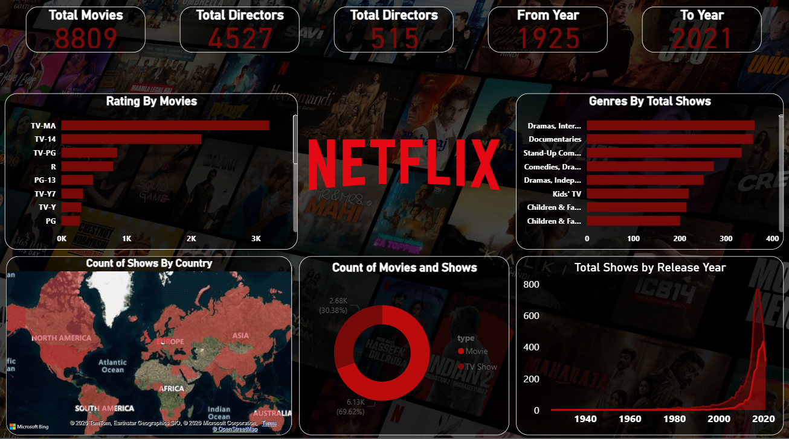

# 🎬 Netflix Content Analysis Dashboard

An interactive Power BI dashboard that provides comprehensive insights into Netflix's content library, including movies, TV shows, ratings, genres, release trends, and geographical distribution.



---

# 📊 Project Overview

The Netflix Content Analysis Dashboard is designed to explore and visualize Netflix's catalog using interactive Power BI reports. The dashboard helps users understand content distribution across genres, ratings, countries, and release years.

This project demonstrates data visualization, data modeling, DAX calculations, and business intelligence reporting using Power BI.

---

# 🎯 Key Metrics

| KPI              | Value       |
| ---------------- | ----------- |
| Total Titles     | 8,809       |
| Total Movies     | 6,131       |
| Total TV Shows   | 2,678       |
| Total Directors  | 4,527       |
| Unique Directors | 515         |
| Content Period   | 1925 – 2021 |

---

# 📌 Dashboard Features

## 1️⃣ Content Summary

Provides a high-level overview of:

* Total Movies
* Total TV Shows
* Total Directors
* Content Release Period

---

## 2️⃣ Ratings Analysis

Analyzes Netflix content based on audience ratings such as:

* TV-MA
* TV-14
* TV-PG
* R
* PG-13
* TV-Y7
* TV-Y
* PG

This helps identify the dominant maturity levels within Netflix's catalog.

---

## 3️⃣ Genre Analysis

Visualizes the most popular content genres on Netflix, including:

* Drama
* International Movies
* Documentaries
* Stand-Up Comedy
* Kids & Family Content
* Independent Movies

---

## 4️⃣ Country-wise Distribution

Interactive world map displaying the geographical distribution of Netflix content production across countries and regions.

Key regions include:

* North America
* Europe
* Asia
* South America
* Africa
* Australia

---

## 5️⃣ Movies vs TV Shows

Donut chart comparison showing the proportion of:

* Movies
* TV Shows

within Netflix's overall content library.

---

## 6️⃣ Release Year Analysis

Tracks the number of titles released over time and highlights the rapid growth of Netflix content production in recent years.

---

# 🛠️ Tools & Technologies

* Power BI Desktop
* Microsoft Excel / CSV
* Power Query
* DAX (Data Analysis Expressions)
* Data Modeling
* Data Visualization

---

# 📂 Dataset Information

The dataset contains information about Netflix titles, including:

* Title Name
* Type (Movie / TV Show)
* Director
* Cast
* Country
* Release Year
* Rating
* Duration
* Genre
* Date Added

---

# 📈 Key Insights

* Movies account for approximately 70% of Netflix's content library.
* TV-MA is the most common content rating.
* Drama and International Movies dominate Netflix's catalog.
* Content production increased significantly after 2015.
* Netflix content is distributed across multiple countries, with strong contributions from North America and Asia.

---

# 📁 Project Structure

```text
Netflix-Content-Analysis-Dashboard/
│
├── Netflix Dashboard.pbix
├── Netflix Dataset.csv
├── Genre & Rating Analysis.png
├── README.md
```

---

# 🚀 Getting Started

### Clone the Repository

```bash
git clone https://github.com/karngaikwad60-pixel/Netflix-Content-Analysis-Dashboard.git
```

### Open the Dashboard

1. Install Power BI Desktop.
2. Open the `.pbix` file.
3. Refresh the dataset if required.
4. Explore the interactive visualizations.

---

# 📸 Dashboard Preview

The dashboard provides detailed insights into Netflix's content ecosystem through interactive charts, maps, and KPIs.

---

# 🔮 Future Enhancements

* Content Recommendation Analysis
* Country-wise Trend Analysis
* Director Performance Dashboard
* Genre Popularity Forecasting
* Netflix Originals Analysis
* Interactive Drill-through Reports

---

# 👨‍💻 Author

**Karn Gaikwad**

GitHub: https://github.com/karngaikwad60-pixel

LinkedIn: Add Your LinkedIn Profile

---

# ⭐ Support

If you found this project useful, please consider giving it a ⭐ on GitHub.
